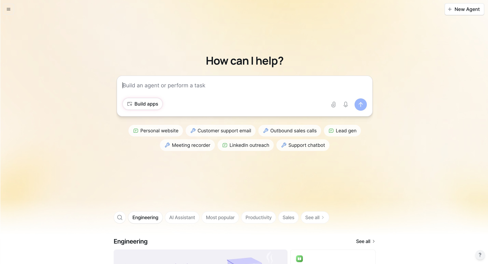

# Build-AI-Agent

# Objective

The objective of this project was to design and implement an AI-powered agent using Lindy through the Extern program to automate real-world workflows and decision-making processes. This project foc[...]

### Skills Learned
- Designed and configured AI agents to automate end-to-end workflows using Lindy
- Built conditional logic and decision paths to handle dynamic inputs and edge cases
- Integrated AI agents with external tools and data sources to trigger automated actions
- Tested and validated agent behavior to ensure accuracy, reliability, and consistent performance
- Applied prompt design and optimization techniques to improve agent responses and task execution
- Documented agent workflows, configurations, and usage for maintainability and handoff
- Analyzed real-world use cases to align AI automation with practical business requirements

### Objective
- Lindy AI platform for building and orchestrating autonomous AI agents
- Extern project environment for guided, real-world AI automation development
- Prompt engineering and prompt testing techniques for consistent agent behavior
- API integrations for validating data flow between AI agents and external systems
- Workflow automation logic (conditions, triggers, and branching paths)
- Web-based configuration and monitoring dashboards
- Functional testing and validation techniques for AI-driven workflows
- Documentation tools for test scenarios, agent logic, and expected outcomes

  

Ref 1: Network Di
## AI Agent Dashboard

